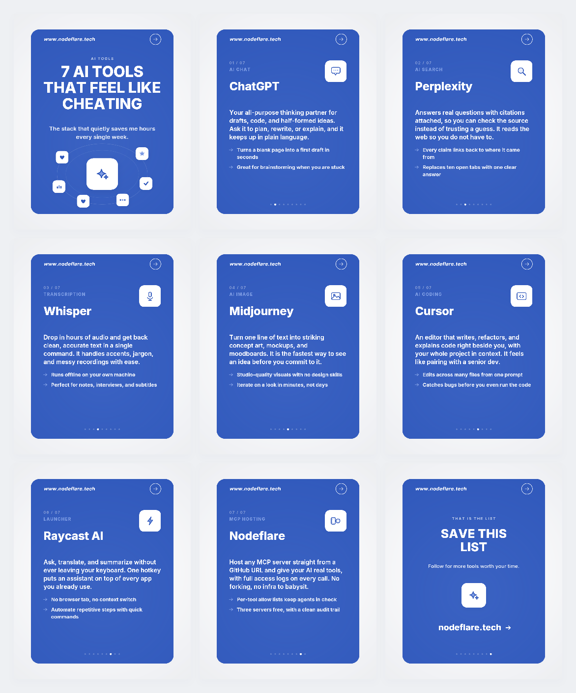

# post-generator-b (remote MCP)

A **remote** MCP server (Streamable HTTP) that generates a TikTok/Instagram
carousel in the **a.png card style** — reproduced **entirely in code** (no image
file, no AI image generation). It picks one of ~30 built-in "listicle" themes
(e.g. *"7 AI tools that feel like cheating"*), renders every slide with
`@napi-rs/canvas` at exact size **in memory**, and hands everything back in the
tool **response**: the post title + overview as text, a **ZIP download URL** (every
slide + `caption.md`, uploaded to a temporary file host), and the **cover inline as a
preview**. Bundling one small ZIP link (instead of many big inline images) is what
survives host size caps and code-mode servers, and lets the user grab the whole set
at once.

> The ZIP is uploaded to **litterbox** (fallback **0x0.st**), so the link is
> **temporary** — download it soon. See *Uploads & expiry* below.



- Card background, the top-right arrow, and the `www.nodeflare.tech` URL are fixed
  chrome, drawn to match `a.png`. Text is **English only** (build fails on any CJK).
- Output size **1080 × 1320** (same ratio as `a.png`).
- A post = **cover + one slide per item + closing** (URL call-to-action).
- Each item slide carries a tag, a full description, and two takeaways — dense copy,
  big and bold, like `a.png` (not one short line).
- **No stdio transport** — this is HTTP-only, meant to be hosted (e.g. on Nodeflare).

## Endpoints

| Method / Path | Purpose |
|---|---|
| `POST /mcp` | MCP over Streamable HTTP (stateless — one server per request). |
| `GET /health` | Liveness + theme count. |

## Tools

| Tool | Args | What it does |
|---|---|---|
| `list_themes` | — | Lists the ~30 themes (`id`, `title`, item count). |
| `generate_post` | `themeId?`, `seed?` | Renders a full carousel in memory, bundles all slides + `caption.md` into a ZIP, uploads it to a temporary host, and returns: one text block (title + overview + **ZIP URL**) plus the **cover inline** as a preview. Omit `themeId` for a **random** theme. |

## Uploads & expiry

The ZIP is sent to a no-auth temporary file host using Node's built-in `fetch` /
`FormData` — no HTTP library:

- **litterbox** (`litter.catbox.moe`) — primary. Auto-deletes after the TTL; the URL
  expires with it. Allowed TTLs: `1h` / `12h` / `24h` / `72h`, set via
  `MCP_POST_UPLOAD_TTL` (default `72h`, the max).
- **0x0.st** — fallback if litterbox fails. Retention is size-based (~30–365 days;
  smaller files last longer).

⚠️ Both are **temporary** — this is "download it soon" delivery, not permanent
storage. For permanent links, swap the uploader for R2/S3 (easy to add).

## Run

```bash
cd mcp-post-generator
npm install
PORT=8787 node src/index.js
```

- `PORT` — listen port (default `8787`).
- `MCP_POST_UPLOAD_TTL` — litterbox TTL: `1h` / `12h` / `24h` / `72h` (default `72h`).

Nothing is written to disk — posts are rendered in memory and the ZIP is uploaded to
a temporary file host, so the download link works from any client without this server
needing a public URL of its own.

### Docker

```bash
docker build -t post-generator-b .
docker run --rm -p 8787:8787 post-generator-b
# clients -> http://localhost:8787/mcp
```

The container runs as a non-root user and writes nothing at runtime. It only needs
**outbound** HTTPS to the upload hosts (`litter.catbox.moe`, `0x0.st`).

## Register in an MCP client

Point the client at the remote URL (no local command):

```json
{
  "mcpServers": {
    "post-generator-b": {
      "type": "http",
      "url": "https://your-host/mcp"
    }
  }
}
```

Claude Code CLI:

```bash
claude mcp add --transport http post-generator-b https://your-host/mcp
```

Then ask: *"generate a random post"* → the assistant calls `generate_post` and gets
the title + overview, a temporary ZIP download link for all slides, and the cover as a
preview.

### Host on Nodeflare

This is already an SSE/HTTP-style MCP server, so it can be deployed straight from a
Git URL: expose `PORT` and point clients at `<assigned-url>/mcp`.

## Add or edit themes

Everything lives in `src/themes.js`. Each theme is:

```js
{
  id, eyebrow, title, subtitle, hook /* cover motif */,
  closing: { title, subtitle },
  items: [
    { name, tag, desc /* ~2 sentences */, points: [p1, p2], motif },
    ...
  ],
}
```

`motif` is any icon name from `src/illustrations.js` (`robot`, `plug`, `code`,
`search`, `chart`, `shield`, …). Keep copy English; the build rejects CJK.

## Files

- `src/index.js` — remote MCP server (Streamable HTTP); renders → zips → uploads → replies; exports `createApp`
- `src/generate.js` — `renderPost()`: build slide list → render to PNG buffers in memory (no disk)
- `src/zip.js` — dependency-free ZIP writer (STORE method) for bundling the slides
- `src/upload.js` — uploads the ZIP to litterbox (fallback 0x0.st) via built-in fetch/FormData
- `src/render.js` — paper + blue card + chrome + cover/item/closing layouts
- `src/illustrations.js` — flat line-art icons + the busy cover scene (a.png style)
- `src/themes.js` — the ~30 themes
- `src/caption.js` — English caption.md builder + CJK guard
- `src/config.js` — geometry + palette (measured from a.png)
- `src/fonts.js` — bundled Inter (English)
